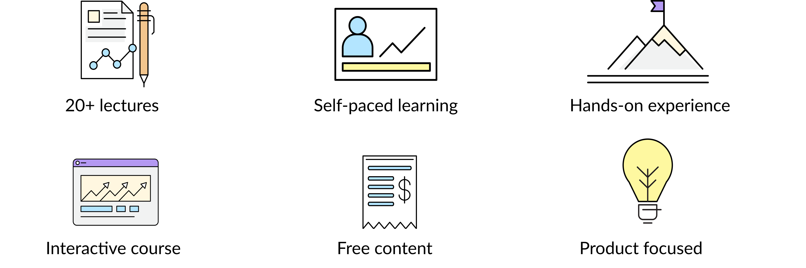

# Productize ML

## About the course

**Productize ML** provides guidelines and best practices for managing the **end-to-end Machine Learning life cycle** and its _productization_.

The course will start diving into the fundamentals around the **Machine Learning** algorithms, from the supervised and unsupervised learning strategies to the latest advances in deep learning techniques; followed by some recommended ways of **accessing and managing data**. Tips and best practices when **training and evaluating models** will be provided. And last but not least, the core piece of this course: how to **bring it to production** and make an outstanding product out of it! 

## Why Productize ML?

* **Learn** **to** **develop** an ML product that can be included in your business solution.
* **Join the community** to interact and share with mentors and fellow students.
* **Manage your time** to go through the course material at your own pace.
* **Practice** with real-world examples built by industry experts.

For more information on how to start this course, please read the course's\*\*\*\*[**Objectives**](introduction/objectives.md) and\*\*\*\*[**Guidelines**](introduction/guidelines.md). 

Join the community at  and follow us on [Twitter](https://twitter.com/productizeML/)!


This course is **constantly growing and expanding**, meaning that some sections might be under construction 🚧 — do NOT panic, and instead leave a message of what you would like to see!


## Instructors

## Course Lectures

### Lectures Breakdown













































\*\*\*\*[                                                       **Productize ML: A Machine Learning in Production Course**](https://smartech.gatech.edu/handle/1853/63975)

## Newsletter



**Have a question or suggestion?** You can reach us at [`adria@productize.ml`](mailto:adria@productize.ml) .

