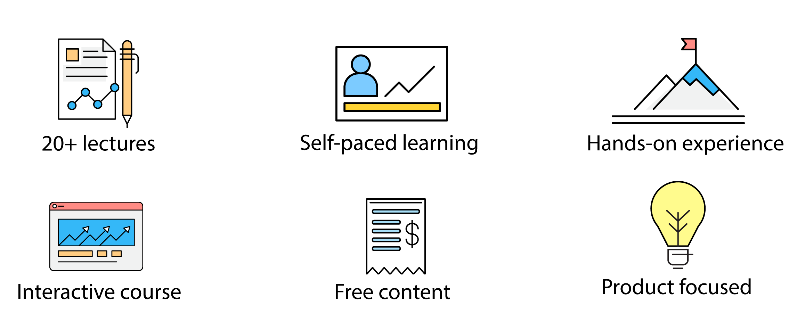
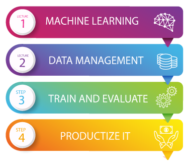

# Productize ML

## A self-study guide for Developers and Product Managers building Machine Learning products

## Welcome!

**WELCOME** to the **ProductizeML** course! 

This course is about building outstanding and practical products from Machine Learning solutions. For more information on how to start this course, please read the course's**Objectives** and**Guidelines**. 

This is a **constantly growing and expanding** course, meaning that some sections might be under construction 🚧 — do NOT panic, and instead leave a message of what you would like to see!

### About the course

* **Learn** **to** **develop** an AI product that can be included in your business solution.
* **Join the community** to interact and share impressions with mentors and students.
* **Manage your time** to go through the course material at your own pace and manage your time.
* **Practice** with real-world examples built by industry experts.

## Course __Lectures

## Guest __Lectures

_Coming soon!_ 

