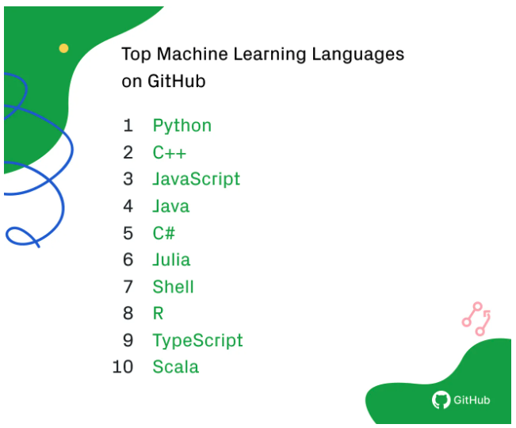
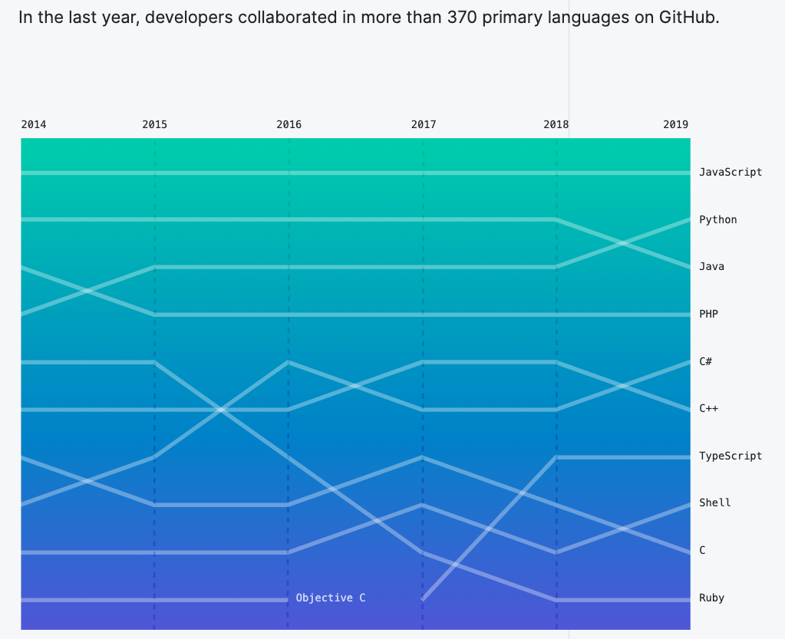

# Python for Machine Learning

A [2018 GitHub study](https://github.blog/2019-01-24-the-state-of-the-octoverse-machine-learning/) looked at contributors to repositories tagged with the “machine-learning” topic, and ranked the most common primary languages of the repositories. Python was the most common language among machine learning repositories and the second most common language on GitHub overall \(2019\). 

Some of the reasons for its adoption and its fast growth are:

* Accessible and has a smooth learning curve.
* Very simple to read and write.
* Efficient and reliable for many applications.
* Healthy, active, and supportive community.
* Vast ecosystem of libraries and tools.

Python has many awesome **visualization packages** and an amazing ecosystem of useful **machine learning libraries** such as:

* [**Numpy**](https://numpy.org/)**:** Numeric Python or Numpy is a Linear Algebra Library for Python with powerful data structures for efficient computation of multi-dimensional arrays and matrices.
* [**Pandas**](https://pandas.pydata.org/)**:** It is the most popular Python library which provides highly optimized performance for data analysis.
* [**Matplotlib**](https://matplotlib.org/)**:** It is a popular python plotting library used for creating basic graphs like line charts, bar charts, histograms, and many more.
* [**Seaborn**](https://www.geeksforgeeks.org/seaborn-distribution-plots/)**:** Provides a high-level interface for creating attractive graphs.
* \*\*\*\*[**Scikit-Learn**](https://scikit-learn.org/stable/)**:** It is used for data mining, data analysis, and machine learning. Contains a wide range of machine learning algorithms like classification, regression, and clustering algorithms including support vector machines, random forests, gradient boosting, k-means.
* [Tensorflow](https://www.tensorflow.org/): It is a free and open-source software library for dataflow and differentiable programming across a range of tasks. It is a symbolic math library, and is also used for machine learning applications such as neural networks.
* [PyTorch](https://pytorch.org/): It is an open-source machine learning library based on the Torch library, used for applications such as computer vision and natural language processing, primarily developed by Facebook's AI Research lab.

