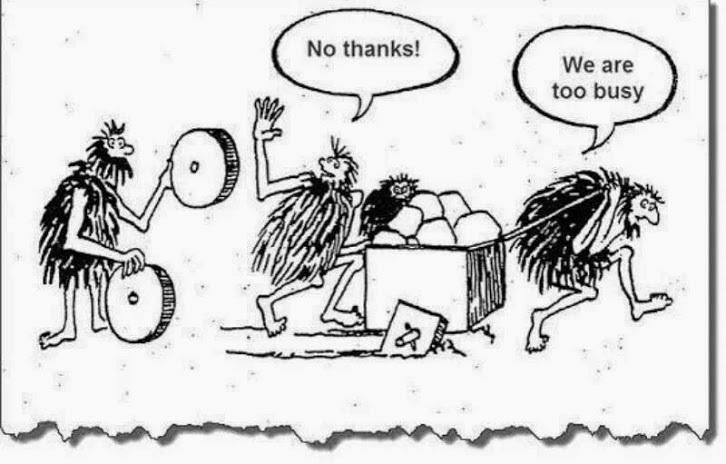

# Objectives

## Let your product be _smart_

If you are reading this, you are probably interested or thinking about coming up with a product that uses any type of Artificial Intelligence or Machine Learning algorithm in order to automate an existing repetitive and time-consuming task with a high-performer AI solution. And not only that, but you want to ship this product to users, so you can collect real-world data, and fed it again to your product so it can learn from it and become smarter over time.

## Productizing ML solutions

In the past recent years, large consumer and Data-driven companies like Google, Facebook, Uber, and Netflix have already deployed ML in scale in their production pipeline as [recommendation systems](https://research.google/pubs/pub45530/), personalize ads, and optimize search results. This was probably thanks to their large data log and big data tools, but even without this key piece, any company should be able to ship a first MVP AI product so users can start adopting and .

## Measuring Business Impact

The course that you are about to start will provide you with guidelines and best practices for the productization of Machine Learning solutions and how businesses can benefit from incorporating AI into their current pipelines.

This is, in fact, a really important point this course focuses on: how to measure the business impact and success of your product not only from the technology point of view but also how it is presented to users and these benefits from it.

## ML Product Management

An AI Product Manager \(PM\) has core product skills \(strategy, roadmaps, prioritization, etc.\) along with an intuitive grasp of ML

* They help identify and prioritize the highest value applications for machine learning and do what it takes to make them successful

## Challenges to solve

Throughout the course, we will learn that once a solution is moved into production, there are some concerns we might face related to data dependencies and changes in the external world, model complexity, reproducibility, testing, monitoring, model deployment, and quick delivery of new models. At the end of this self-study course, you will feel confident on how to build a solution that prevents these setbacks to happen, as well as the best way to tackle these.

## Content

In general terms, this course will provide the learner with:

* Common and most-used **AI**, **Machine Learning**, **Deep Learning**, and **Data Science**

  terminology;

* What someone can expect **realistically** from these systems to do and

  what they actually cannot do;

* Abilities to understand what the **opportunities** of an **AI/ML product** are and how

  these will impact their institution/organization/personal project;

* Computational resources and recommended frameworks;
* Best practices on data collection and curation;
* Training, optimization, and monitoring of Machine Learning models;
* Instructions on how to build reproducible machine learning pipelines;
* Create continuous and automated integrations to deploy models;
* When building a product, what things we want the AI solution to improve or

  enhance when compared to traditional solutions;

* Recommendations on how to deliver AI/ML-generated predictions to users;
* Understand real-world cases and users data;
* Hands-on exercises and assignments;

For more information on how the course is organized, please visit [Syllabus](https://www.notion.so/Syllabus-6f397bb844a64337a09a0092125a40fb).

## The course

In order to achieve that, this course is online and open-ended regarding the product and technical delivery recommendations. The shared content will get updated periodically in order to guarantee new and state-of-the-art information. The community \(you\) will engage with the course in the form of [chats](https://productizeml.slack.com/join/shared_invite/zt-f5ygmpyq-sr5qQIpGURSC_SEigyDaww#/) and [comments](https://www.notion.so/Sharing-permissions-524c32ac63dc424a842891ace7a99bf8), and they will take an important role in the content of the course as well, promoting a shared course built thanks to every learner. This course is quite unique not only to the content that is delivered given its novelty but also regarding the technologies that will be used. For more information, jump to the course [Guidelines](https://www.notion.so/Guidelines-44840ce96a424e4390a6856878b65d59).

The estimated course time will be of 8-10 hours, including course-specific content, recommended readings from other sources like articles and blog posts, and finally a course-specific hands-on experience.

One more time, _**Welcome**_ to this exciting course!

