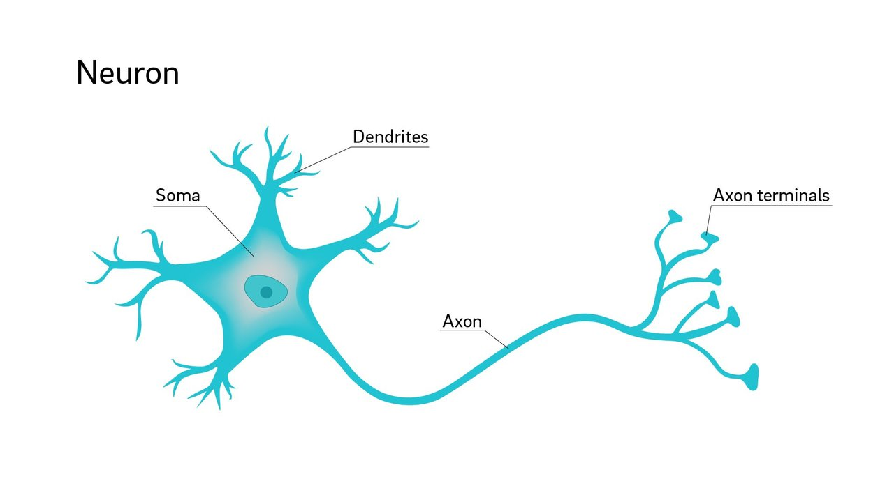
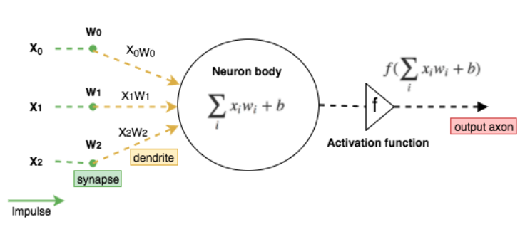
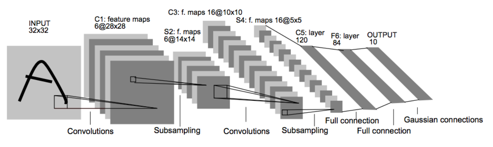
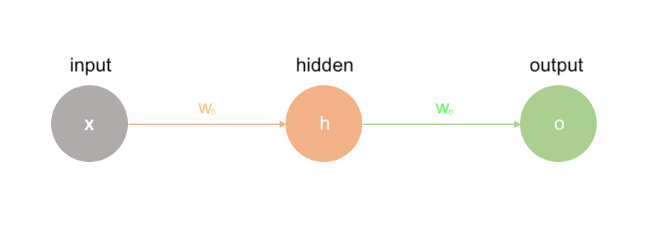
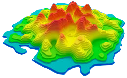
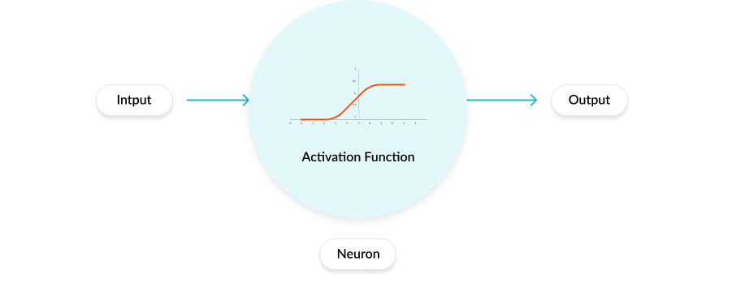
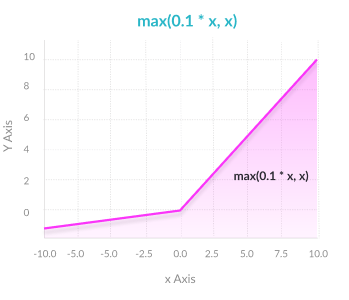

# Deep Learning

## Neural Networks

Artificial Neural Networks, or simply **Neural Networks** \(**NN**\) in the ML field, are a category of machine learning algorithms whose design has been inspired by the neurophysiological workings of the human brain. 

These computational models have a unique ability to extract meaning from complex data by finding patterns and detect trends that for the human mind can be hard to achieve. They are widely used nowadays in many applications: image classification tasks, voice recognition, facial recognition, character recognition, stock market prediction, among many more.

NNs use a mathematical model of a neuron as $$f(\sum_i x_i w_i + b) $$ , in which the input nerve impulse \( $$x_i$$ \) is multiplied by a learnable matrix of weights \( $$w_i$$ \), that represent the synaptic strengths of neurons. 

The second parameter that the model can learn is called the bias term \( $$b $$ \), which is directly added to the element-wise multiplication of previous matrices.

The mathematical model of the neuron will fire the output signal \( $$x_iw_i$$ \) according to an **activation function** \( $$f$$ \), which introduces a non-linearity to the equation. Considering the multiple impulses a neuron can receive as an input, the output of the mathematical model can be expressed as previously stated $$f(\sum_i x_i w_i + b)$$.

### Types of Layers

Neural Network contains millions of neurons organized into three kinds of layers:

* I**nput layer**: neurons in this layer do not have inputs themselves, they just hold the data that will be shown to the training.
* **Hidden layers**: connected to the input layer, act as intermediary values computed as the weighted sum of the input node values and apply an activation function before passing on the next subsequential hidden layer.
* **Output layer**: connected to the hidden layers, these are computed as the weighted sum of the hidden node values.

### **Types of NNs**

Common types of Neural Networks algorithms include [Autoencoders](unsupervised-learning.md#autoencoders) \(AE\), Boltzmann Machines \(BM\), Convolutional Neural Networks \(CNN\), Deep Residual Networks \(DRN\), Generative Adversarial Networks \(GAN\), Long/Short Term Memory \(LSTM\), Recurrent Neural Network \(RNN\), and [Support Vector Machine \(SVM\)](supervised-learning.md#3-support-vector-machines), among many other that are less used.

Depending on the goal that your algorithm is expected to achieve, some of these will do better than others based on the data format and performance expectations.

#### Convolutional Neural Networks

**Convolutional Neural Networks** \(also known as CNNs or ConvNets\) maintain a strong relationship with Artificial Neural Networks: they are also inspired by the behavior of biological systems through artificial neurons with learnable weights and biases. The layered architecture that Neural Networks performs based on matrix multiplications enables its application for image classification tasks. For this reason, ConvNets architectures assume that the inputs are images that have to be transformed into an output holding the class score predicted.

CNNs work similarly to Neural Networks: each neuron receives an input, a dot product \(Hadamard product or elementwise multiplication\) between each input, and its associated weight is performed, followed by a non-linearity. The most common hierarchical distribution of ConvNets layers contains:

* **Input layer**: containing the raw pixel values from input images.
* **Convolutional layers**: the core block of ConvNets, computes a locally dot product \(2D in

  the case of images\) between the weights and a certain tiny region of the input volume.

* **Non-linear layers**: most of the times using a ReLU activation function which applies an elementwise activation by thresholding at zero.
* **Pooling layers**: that apply a spatial downsampling along the output volume.
* **Fully Connected layers**: that compute the class scores, where each neuron is fully paired with adjacent neurons.

A CNN structure is made up of repetitive patterns \(which explains the expression deep learning\) of Convolutional, ReLU, and Pooling layers \(considered hidden layers\) and finally the fully-connected layers. The resulting volume structure is called a feature map \(in the case of images, it has a two-dimension volume\). The learning process \(also referred to network training\) where weights are optimized is achieved through [backpropagation](https://www.notion.so/adriaromero/Deep-Learning-08ec6b6a699d4c5bb385f4ac2c7533b6#886872274faf443185cebbc4a616a786), a technique to efficiently compute gradients for its weights with respect to the loss function.

## Forward propagation

Before describing one of the most known neural networks training algorithm called backpropagation, we should stop ourselves and quickly review to a simpler and predecessor **forward propagation algorithm.**

If we depict the simplest of the Neural Network cases as follows:

The way that the input data $$x$$ is "_forward propagated_" through the network layer by layer \(in this case, just a single hidden layer $$h$$ \) till the end $$o$$ follows the mathematical expression:

$$
output_{prediction} = A(A(xw_h)w_o)
$$

where $$x$$ is the input to the network, $$w_h$$ , and $$w_o $$ are the hidden layer and last layer \(output\) weights, and $$A$$ represents an[ Activation Functions ](deep-learning.md#activation-functions)such as **Rectified Linear Unit**, **Sigmoid**, **Hyperbolic tangent**, etc.

## Backpropagation

The **backpropagation algorithm** has the objective of helping the neural network to learn the parameters by adjusting each weight in proportion to how much it reduces the overall error. Following this idea, the better we can adjust the weights, the smaller the error will be and the better the model predictions will become.

The same way forwardpropagation follows a long series of nested equations, the backpropagation algorithm can be seen as the "transposed" process by applying the [Chain rule](https://en.wikipedia.org/wiki/Chain_rule) to find the derivatives of the loss function with respect to any variable in the forwardpass equation $$f(x) = A(B(C(x)))$$ , being $$A, B$$ and $$C$$ activation functions at different layers. 

If we apply the Chain rule to $$f(x)$$ , it will look like:

$$
f'(x) = f'(A) \cdot A'(B) \cdot B'(C) \cdot C'(x)
$$

In simple terms, after each forward pass through a network, backpropagation performs a backward pass while adjusting the model’s parameters \(weights and biases\) and an optimization algorithm called [Gradient Descent](deep-learning.md#gradient-descent) is used to update the parameters of our model.

### Gradient Descent

The **gradient descent** is used as an optimization algorithm in order to minimize \(typically in ML\) a loss function by trying to find the directions for which the function will decrease its values the most. These directions will be given by the slope of the loss function that guarantees that the model will perform more accurately, and they are computed as the gradients of the function.

The step size for which the weights of a model are updated regarding gradient descent is called **learning rate**. Common types of gradient descent algorithms include [Stochastic Gradient Descent](https://en.wikipedia.org/wiki/Stochastic_gradient_descent).

## Activation Functions

**Activation functions** try to simulate the natural behavior of neuronal firing when neurons communicate with each other through electrical impulses. This time, though, the activation function is found inside the neural network and is responsible of by-passing the model's feature information from one layer to the following ones. In order to replicate the neuronal firing process, activation functions are mathematical "gates" that can be represented as linear or non-linear functions.

The most common activation functions used in neural networks architectures are:

* **Sigmoid**: logistic transformation with expression $$\sigma(x)=\frac{1}{1+e^{-x}}$$ that reduces extrem values and outliers without removing them.

* **Softmax**: returns the distribution of probabilities over mutually exclusive output classes and it can be seen as a generalization of logistic regression since it can be applied to continuous data as $$\sigma(x)_i = \frac{e^{x_i}}{\sum_{j}^{ }e^{x_j}}$$ .
* **ReLU** \(**Rectified Linear Unit**\): one of the current state-of-the-art activation function since it solves gradient vanishing issues. It is represented as $$f(x)=max(0,x)$$ that applies a threshold at zero.

* **Leaky ReLU**: adds a small positive slope in the negative area of the ReLU so it can help the backpropagation training process.

## Loss functions

The **loss function** is used to measure how well the network's predicted scores agrees with the ground truth labels in the input data. As we have previously mentioned when describing the gradient descent algorithm, in order to obtain the gradients, the loss function needs to be differentiable at all times. Most used loss functions are [MSE \(L2\)](https://en.wikipedia.org/wiki/Mean_squared_error) and [Cross-entropy](https://en.wikipedia.org/wiki/Cross_entropy).

## Readings

{% embed url="https://wiki.pathmind.com/neural-network\#:~:text=Neural%20networks%20are%20a%20set,labeling%20or%20clustering%20raw%20input" %}





