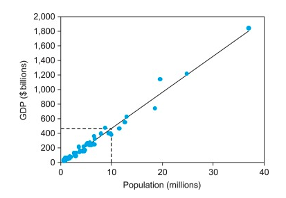
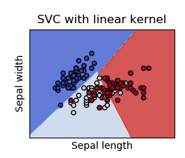
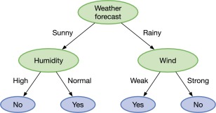

# Supervised Learning

## Linear Regression

**Linear regression** is a supervised machine learning algorithm where the predicted output value keeps a linear \(continuous\) relationship with the input.

#### **Example 1**

One simple application of linear regression can be used to predict the economic activity of a country in relation to its population.

We can distinguish between two types:

1. **Simple** **regression**

When just considering a single variable as input data, the linear regression line can be expressed with an equation of the form:

$$
\sf{y = mx + b}
$$

Where $$m $$ and $$ b$$ are the weights our algorithm will try to “learn” to provide the most accurate predictions $$y $$. $$x$$ represents our input data and $$y$$ represents our prediction.

Given **Example 1**, linear regression would let us predict the economic activity \( $$y$$ \) from the number of people \( $$x $$ \). For instance, for a region with 30 million people, the expected GDP value would be about $1,400 billion.

The same inverse logic could be applied if trying to predict the population \( $$x$$ \) from its economic activity \( $$y$$ \). In that case, we would reverse the regression equation to:

$$
\sf{x = \frac{y -b}{m}}
$$

1. **Multi-variable regression**

Following the same idea, if several variables play a role in the linear prediction, multiple weights  $$w_i$$ will apply to each variable in the following form:

$$
f(x, y, z) = w_0 + w_1x + w_2y + w_3z
$$

where this time $$w_i $$are the coefficients the algorithm will try to “learn” to provide the most accurate predictions given $$x, y$$, and $$z$$ as input data.

#### Example 2

| Company | Employees | R&D Investment \($M\) | Income \($M\) | Sales \(M units\) |
| :--- | :--- | :--- | :--- | :--- |
| A | 15,000 | 2 | 3 | 5 |
| B | 30,000 | 3 | 2 | 3 |
| C | 10,000 | 1.5 | 1 | 2 |

In Example 2, we can still predict the sales of a company given the number of employees, investment in R&D and income as follows:

$$
sales = w_0 + w_1*employees + w_2*R\&D_{investment} + w_3 * income
$$

## **Loss function**

In order to find the best weights $$w_i $$ that minimizes the error between the model's predictions from its ground-truth labels, we must introduce the concept of a **loss value**. We could describe it as the absolute difference between the true value and the predicted one.

When this measurement is applied to a set of evidence, we call it **loss function** \(or **cost function**\). It can be understood as a measurement of how "good" your model is: the lower the loss, the better your model is.

For linear regression models, we typically use **Mean Squared Error** \(MSE\) as a loss function:

$$
MSE = \frac{1}{N}\sum_{i=1}^{n}{(y_i-(mx_i+b))^2}
$$

where $$N$$ is the total number of samples.

To find the value of the parameters that minimize the cost function, there is a closed-form solution — in other words, a mathematical equation that gives the result directly. This is called the [Normal Equation](https://www.coursera.org/lecture/machine-learning/normal-equation-2DKxQ).


How can we compute the optimal parameters when we have a lot of data and features and they can't fit in memory or it is computationally too expensive? 

The answer is via [Gradient Descent](deep-learning.md#gradient-descent), covered in the [Neural Networks](deep-learning.md#neural-networks) section.


## 2. Logistic Regression

**Logistic regression** is another supervised learning method to classify samples by assigning a discrete set of classes. 

Similarly, as linear regression makes predictions on continuous number values, logistic regression uses a logistic **Sigmoid** function as a prediction value associated with multiple variables of the form:

$$
y = \frac{1}{1 + e^{-z}}
$$

The logistic curve of the Sigmoid function for which outputs are between 0 and 1. This property allows the regression to provide a probability value.

We can distinguish between three types:

1. **Binary classification**

   This regression type only considers situations in which the observed outcome for a dependent variable only takes two types. As an example, we might use logistic regression to classify lung cancer as benign or malignant.

2. **Multi-class classification**

   In this second case, the outcome can be presented as three or more types. An example case could be predicting the type of lung cancer as e.g. "cancer A", "cancer B", or "cancer C".

3. **Ordinal classification**

   Same idea as in \(2\) Multi-class classification, but this time the predictions are ordered with a sense of positioning. An example case could be a restaurant service rating choice among "poor", "fair", "good", and "excellent".

## 3. Support Vector Machines

**Support vector machines \(SVMs\)** are a set of supervised machine learning algorithms for classification, regression, and outlier detection that are built around hyperplane separation of the data. In a two dimensional space, this separation can be understood as a simple decision boundary in the form of a line, but SVMs are also effective in high dimensional spaces.

Thanks to their great adaptation to multidimensional spaces, SVMs are often used for Natural Language Classification problems.

## 4. Decision Trees

**Decision trees** are non-parametric supervised machine learning techniques that are able to make predictions by learning simple decision rules encoded in a flowchart-like structure.

These tree structures are easy to represent and interpret. Leaves on the tree represent classifications labels, non-leaf nodes are features, and branches represent conjunctions of features that lead to the classifications.


When grouping multiple decision trees together, we refer to this ensemble of models as **random forests**.


