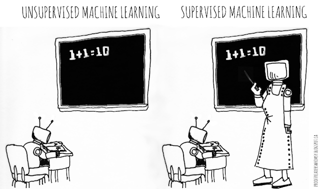
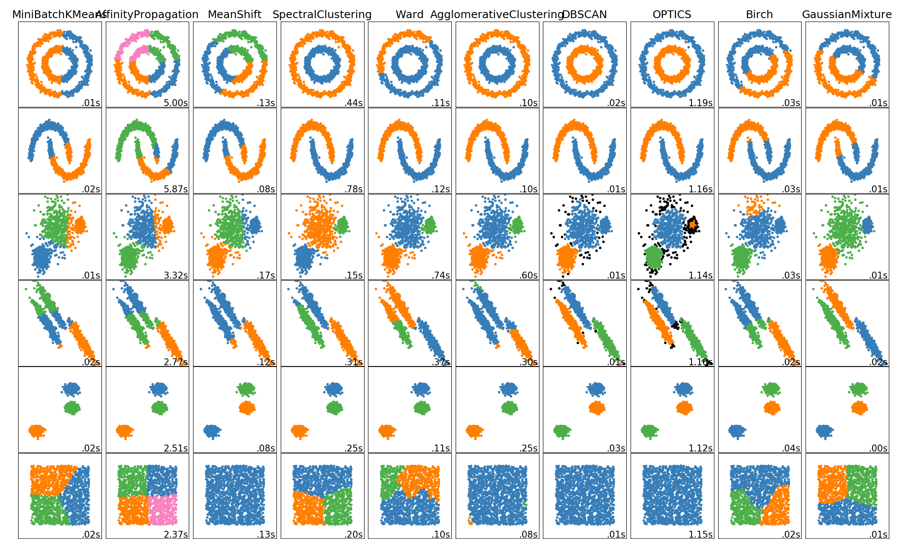

# Unsupervised Learning

A really important requirement we asked our data to fulfill when talking about [Supervised Learning ](supervised-learning.md)techniques is this to contain associated labels. 

This is, in fact, a really time-expensive demand given the large volumes of data some Machine Learning algorithms require generalizing well during training. Not only time but also the economic cost associated with the labelling process can be expensive when the domain knowledge belongs to a specific field like for instance medical data.

Despite this, it is common to find scenarios where large volumes of unlabelled and unstructured data are available, and we still want to understand it better. These are the cases where **unsupervised learning** techniques can help to find hidden patterns in this unlabelled data.

## Clustering

A simple way to find insights in unlabelled data is via **clustering techniques** in such a way those data points that share similar properties will belong to the same groupings, and dissimilar points will form other groupings. These algorithms can clearly help with classification tasks, as well as statistical data analyses.

In this fast-paced course, we will only review one of the most well-known clustering algorithms, K-Means, but we should be aware of many more such as Hierarchical clustering, Gaussian mixtures, Mean-shift, and others.

### K-Means

K-means is one of the simplest unsupervised learning algorithms that works as a clustering technique by selecting _k_ central points or means \(hence K-Means\). Once these means are computed, they are used as the centroid of the cluster and an association among neighbour points is done in a way that any point that is closest to a given mean is assigned to that mean’s cluster.

The algorithm works iteratively until it converges to a local optimum as follows:

1. Select **K** initial cluster means, $$\{ \mu_1, ..., \mu_k \}$$ 
2. Iterate until the stopping criterion is satisfied: 
   1. **Assign** each data sample to the closest cluster $$x \in C_i , d(x, \mu_i) \leq d (x, \mu_j),\forall i\neq j $$ 
   2. **Update** K means from assigned samples $$\mu_i = E\{x\}, x \in X_i, 1 \leq i \leq K $$ 

Once all the points have been assigned to a cluster and the stopping criterion has been reached, the algorithm is said to have converged.

## Dimension reduction

The concept behind **dimensionality reduction** is quite simple: reduce the dimensionality of your feature set. Particularly when computing features using [Deep Learning ](deep-learning.md)techniques, these are usually of high magnitude values and therefore challenging to manage and take insights from the raw data.

Working with a dimensional feature subspace may help when analyzing the data in the form of visual graphics, or even come up with the best dimensionality for your feature set to be fed to the training algorithms. This last observation is hard to answer since some algorithms might do well on large feature vectors, and others might struggle to converge. This is called the "**Curse of Dimensionality**", and it can be mitigated via the dimensionality reduction techniques that follow.

### Principal Component Analysis \(PCA\)

Popularly used for dimensionality reduction in continuous data, PCA is used to decompose a multivariate dataset in a set of successive orthogonal components that explain a maximum amount of the variance.

The iteration includes rotating and projecting the data along the direction of increasing variance, in a way that the features with the maximum variance become the principal components.

### t-SNE

**t-Distributed Stochastic Neighbor Embedding** \(**t-SNE**\) is a technique for dimensionality reduction that is particularly well suited for the visualization of high-dimensional datasets. The reduction consists in converting similarities between data points to joint probabilities and tries to minimize the Kullback-Leibler divergence between the joint probabilities of the low-dimensional embedding and the high-dimensional data. This way, we can convert feature maps of thousands of dimensions to a minimal two-dimensional map easy to interpret.

You can find some examples applied to real-world datasets in [Laurens van der Maaten's blog](https://lvdmaaten.github.io/tsne/), t-SNE visualizations of the MNIST dataset in [Colah's blog](https://colah.github.io/posts/2014-10-Visualizing-MNIST/), and [how to use t-SNE effectively](https://distill.pub/2016/misread-tsne/) since its flexibility makes it hard to interpret sometimes.

### Autoencoders

Another popular dimensionality reduction method that gives successful results is **autoencoders**, a type of artificial neural network that aims to mimic the inputs to the outputs. These networks reduce the input data into a **latent-space representation** and then reconstructs the output from this representation.

An autoencoder is composed of two parts :

1. **Encoder:** compresses the input into a latent-space representation.
2. **Decoder:** reconstruct the input from the latent space representation.

### Readings







