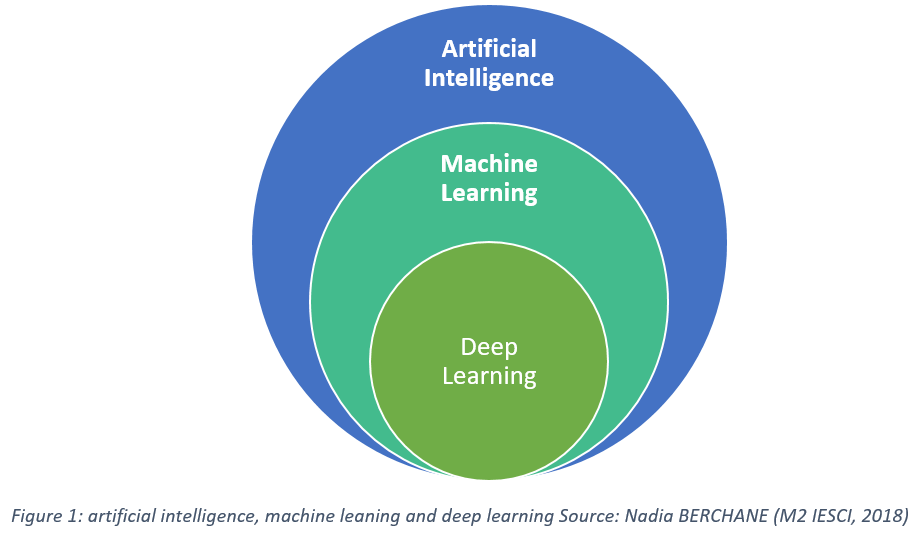

# Why ML, and why now

**Machine Learning** is an Artificial Intelligence subfield that, in short words, combines big data and statistical techniques to enable computer systems to learn from past examples and generalize when making predictions on unseen cases.

AI-ML-DL graphic 

Machine Learning has been a hot topic since decades around academia, but it has recently takeoff in the Industry sectors to thanks to big **four phenomenons**:

1. the **algorithms** and **research** **advances** \(Krizhevsky, 2012; Ioffe, 2015; Lan, 2019; Srivastava, 2014; Radford, 2019\) that have demonstrated and proven the potential benefits that these technologies could have in society when brought to production.
2. the **digitization process** and access to new **data sources** \(Brickley, 2019\) that let the large artificial networks generalize to new unseen cases and therefore automating some of our daily tasks with smarter decisions.
3. the availability of **programmable frameworks** that contain most part of today’s state-of-the-art algorithms and methods in order to carry out research experiments \(Abadi, 2016; Paszke, 2019; Pedregosa, 2011\) and makes them accessible and easy to incorporate to the whole community; and finally but still key in this development of ML.
4. the equipment with **computational power** provided by Graphics Processing Unit \(GPUs\) in order to be able to feed all the vast amounts of data depending on their types \(image, audio, text, etc.\) and let the execution be parallelizable.

When all these four pieces are put together and taken to production, a need for standardization and regulation of processes is strongly recommended so the community can work and evolve as a whole and within a sense of collaboration.

[Machine learning types and their applications](https://developer.ibm.com/recipes/tutorials/machine-learning-and-ibm-watson-studio/)

[27 Incredible Examples Of AI And Machine Learning In Practice](https://www.forbes.com/sites/bernardmarr/2018/04/30/27-incredible-examples-of-ai-and-machine-learning-in-practice/#3518919a7502)

There are in fact many cases where

