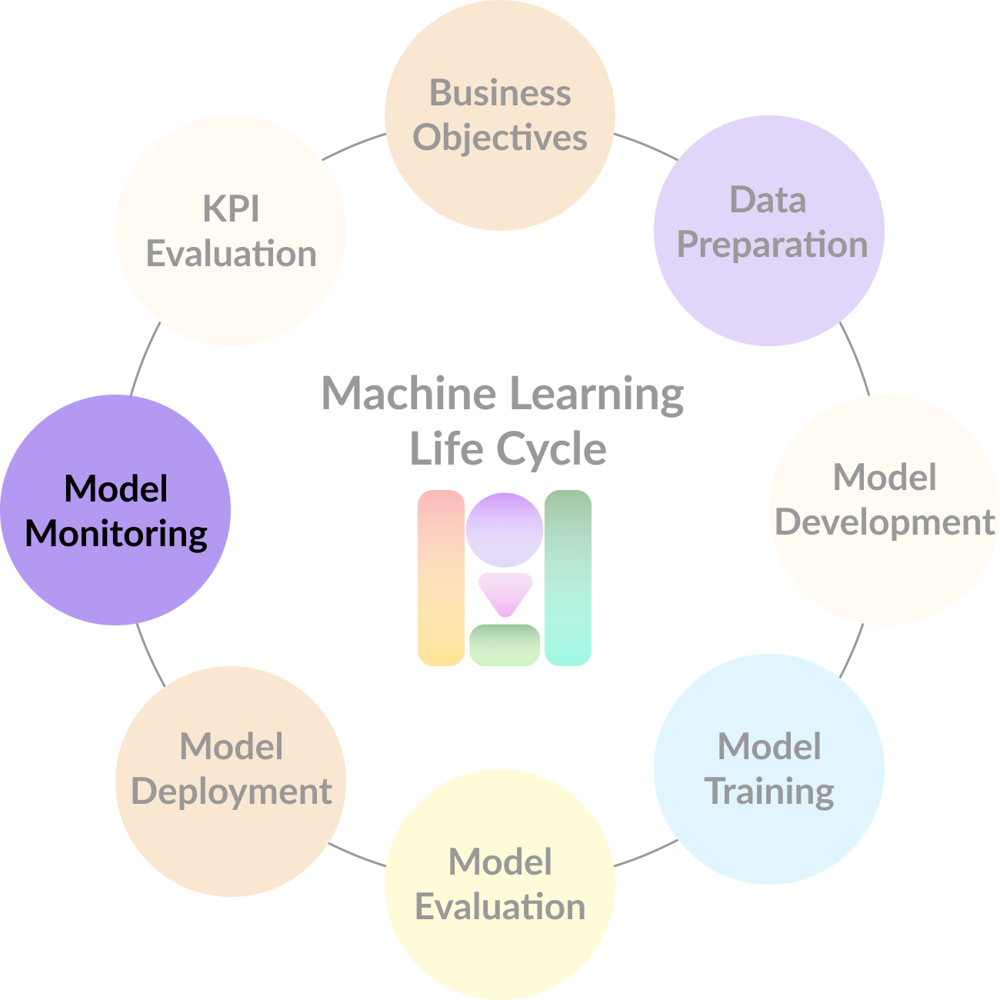

# A/B Testing

We can find multiple strategies to measure your machine learning model and product impact over your business, such as reactions from your **stakeholders**, **partners**, and **employees**, **Return on Investment \(ROI\)**, among others, but in this course, we will focus on the well-known **A/B testing** approach.

**A/B testing** can help to obtain research statistical significance when running two different experiments in order to obtain a better sense of your customers.

And after each iteration, try to answer:

* **Did the user visit the next day?**
* **How long did the user visit the site?**
* **What were the daily active users?**

Along with the study, you should conduct user research questions like:

* **Is the user happy using the product?**
* **Is the user satisfied with the experience?**
* **Is the product improving the user’s overall well­being?**
* **How will this affect the company’s overall health?**

Since most all of these questions are hard to measure, Product Managers tend to use proxies in order to assess questions in an open way: if the user is happy with the product, they will stay on the site for a longer time. If the user is satisfied, they will visit again tomorrow.

Another recommended approach when measuring and monitoring your solution in order to satisfy your business continuity requirements when launching an AI solution is to try to encode business metrics into your loss function in order to evaluate how well your models are doing regarding your business needs.

## Readings







