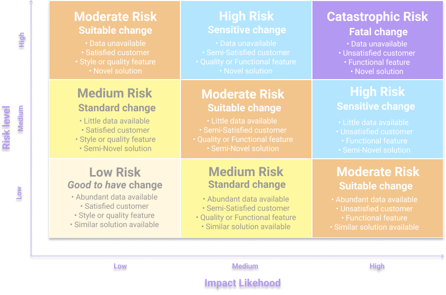

# Business Objectives

Before even thinking about the type of data, model architectures, types of deployments, or infrastructure that you are going to use, the first step when defining your **product roadmap** towards building an AI product is quite simple: you should start defining the **business needs**.

Some questions that might help in defining these needs are:

* **What service or feature my product would benefit from automation?**
* **What internal processes and business assets I can make more efficient?** Machine Learning can also help you not only build better products but also in your internal processes.
* **How does my data look like?** Data can definitely guide you to define a new product feature and evaluate it as a potential business need.

Depending on the complexity of the problem to solve, we will determine the type of solution required. Most of the time, Machine Learning approaches adds more uncertainty to the product roadmaps, so we do not want to overcomplicate a solution that can be solved with traditional approaches. So you should start with simple approaches that can partially solve your problem, and gradually increase the coverage of this.

A safe approach to start incorporating AI solutions to your product is by measuring the **risks and impact** of your product's features and start with those with lower risk and higher impact.

