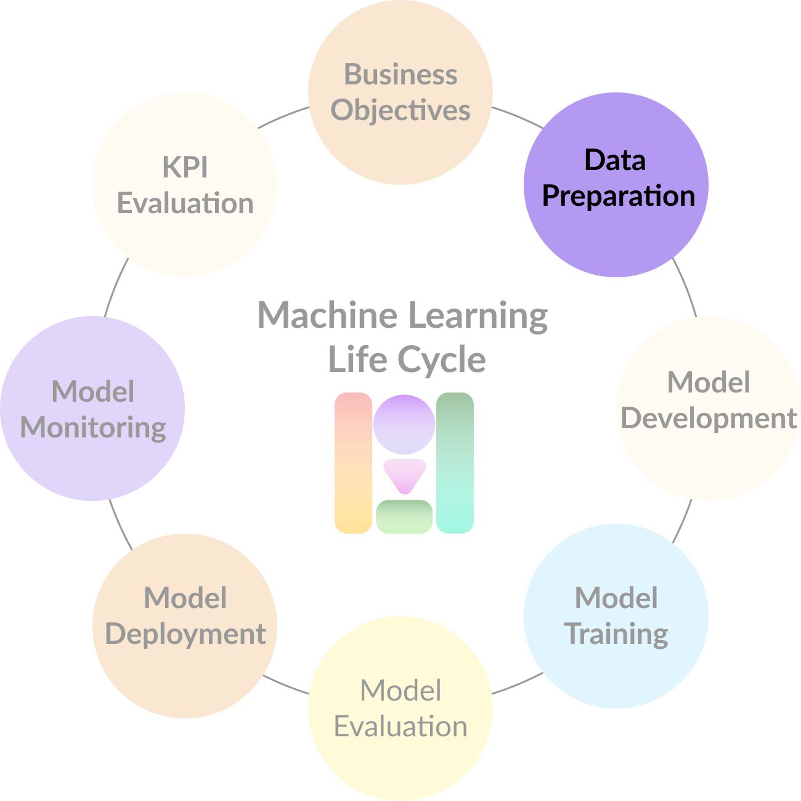

# Data Preparation

As previously mentioned in the [Data Access](../data-management/untitled.md) lecture, getting access to the matching data domain of your problem, and curating this data is a time-consuming and demanding job. For this reason, it can introduce risk factors as previously mentioned in the _ML risk impact assessment_ table from [Business Objectives](business-objectives.md).

Data and ML technologies always live in **symbiosis**. We can also see it as ML being the hammer, and data the nail — the hammer will completely be useless without the presence of the nail. And not only that, but we will find plenty of types of nail and hammers, but only finding the right match will make it work.

Keeping this in mind, we can think about three common scenarios:

1. **We have data, but technology is not ready**. This is the case when you must spend time understanding your data in order to know what is the best technology to use. Plenty of data does not particularly mean that it can feed your ML algorithm. Once you have _learned_ your data, it is time to hire some data scientists to come up with the most suitable technology. 
2. **We \(think to\) have the technology ready, but we lack of data**. It seems we have the solution well thought, and we know what the direction to go is, but we still need to collect the right data. 
3. **Data and technology are available**. This is the clearest of the cases where you should start developing and training your models, deploy your product, and iterate over it to clearly understand your customers' needs. 

