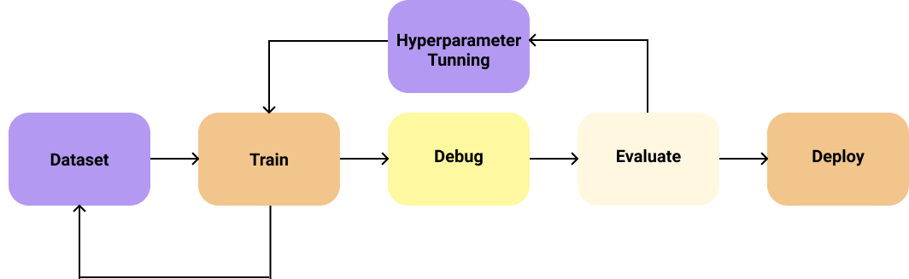

# Train, Evaluate, and Deploy

Once you deploy the first version of your product is when you really start working on it since you will start understanding better your users and their real needs.

Firstly, it is crucial to understand that your data will keep growing over time, and the sooner you can feed it back to your system, the better your model will generalize to your problem domain.

Once you move on to train models, try to keep your system _simple_:

* start with **light models**, **small architectures** so they can be easily debugged, e.g. [MobileNet](https://arxiv.org/abs/1704.04861) for visual classification tasks.
* take a **small sample of your dataset** that you are certain that is properly curated.
* try approaches that **have worked for others**, e.g. for convolutional networks, use ReLU activation functions; or for LSTM models, TanH activation.
* **normalize** your data before feeding it to the model.
* for class imbalance problems, start with a **balanced subset** so you can skip weighting your loss function.
* keep the **number of classes fixed**, so you can guarantee a fair comparison between models.

## Debugging

Before evaluating your model, is highly recommended **debugging** your system to make sure that the model is not **overfitting** to your training data, making sure your experiments are **reproducible** \(using seed values can help the debugging process\), **compare** similar architectures trained on the same data with small variations to the hyper-parameter values, or take **third-party models** from frameworks like Keras that they most of the times guarantee correct functionality. **Unit tests** are strongly suggested to be included in your code pipeline.

In order to guarantee a fair evaluation, validation techniques like **cross-validation** are commonly used. A recommended practice is to **benchmark** your solution to others like challenges or public test sets.

In order to **improve** the performance of baseline solutions, more **complex architectures** can be proposed to overcome under-fitting, or **data augmentation** and/or **regularization** techniques can help with overfitting problems. Playing with a range of different **hyperparameter values** can also benefit the training process. Some frameworks like Keras provide features like [Keras Tuner](https://keras-team.github.io/keras-tuner/) to enable the search of the _best_ hyperparameter values.

## Deployment

Once you are satisfied with the performance of your model, your prediction system is ready to be deployed into the serving system. ML engineers usually work with a combination of **Docker** for local development, shipping code, and deploying operations, and **Kubernetes** to automate container orchestration systems. The final solution can be presented as a **web interface** or as a **REST API** service, applying inference using CPU or GPU depending on the computational demand.

