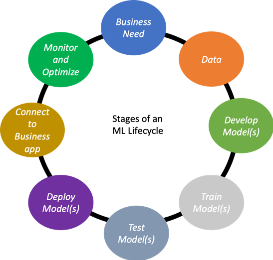

# ML Product Development Process

## Business needs

The first step before thinking about the type of data, model architectures, types of deployments, or infrastructure that you are going to use, is quite simple: define what the problem you want to solve. And most of the cases this means defining your **business needs**.

Some questions that might help on defining the business needs are:

* **What service or feature my product would benefit from automation?**
* **What internal processes and business assets I can make more efficient?** Machine Learning can also help you not only building better products, but also in your internal processes.
* **How does my data look like?** Data can definitely guide you to define a new product feature and evaluate it as a potential business need.

Depending on the complexity of the problem to solve, we will determine the type of solution required. In most of the cases, Machine Learning approaches adds more uncertainty to the product roadmaps, so we do not want to overcomplicate a solution that can be solved with traditional approaches. So you should start with simple approaches that can partially solve your problem, and gradually increase the coverage of this.

A safe approach to start incorporating AI solutions to your product is by measuring the **risks and impact** of your product's features and start with those with lower risk and higher impact.

## Data

As previously mentioned in the [Data Access](../data-management/untitled.md) lecture, getting access to the matching data domain of your problem and curating this data is a time-consuming and demanding job. For this reason, it can introduce risk factors as previously mentioned in the _Risk impact assessment for ML products_ table.

Data and ML technologies live always in **symbiosis**. We can also see it as ML being the hammer, and data the nail — the hammer will completely be useless without the presence of the nail. And not only that, but we will find plenty of types of nail and hammers, but only finding the right match will make it work.

Keeping this in mind, we can think about three common scenarios:

1. **We have data, but technology is not ready**. This is the case when you must spend time understanding your data in order to know what is the best technology to use. Plenty of data does not particularly mean that it can feed your ML algorithm. Once you have _learned_ your data, it is time to hire some data scientists to come up with the most suitable technology. 
2. **We \(think to\) have the technology ready, but we lack of data**. It seems we have the solution well thought and we know what the direction to go is, but we still need to collect the right data. 
3. **Data and technology are available**. This is the clearest of the cases where you should start developing and training your models, deploy your product and iterate over it to clearly understand your customers needs. 

## Develop Models

Before starting to develop your own models, you should probably spend some time looking if someone or any other company has faced the same problem before. If so, maybe you might consider coming up with a similar approach or requesting access to one of their services.

You can find platforms like [Model Zoo](https://modelzoo.co/), that curates and organizes research works and makes deep learning pre-trained models available to either plugging it into your system or training it on the top of their task. You can find different categories that go from computer vision, NLP, unsupervised learning, or reinforcement learning.



Only if you cannot find related work, then it is time to do some research to try to come up with the most optimal technology set up around network architectures, tools to use, hyper-parameters values, etc.

## Train, Test and Deploy Models

Once you deploy the first version of your product is when you really start working it since you will start understanding better your users and their real needs.

Firstly, it is crucial to understand that your data will keep growing over time, and the sooner you can feed it back to your system, the better your model will generalize to your problem domain.

Once you move on to train models, try to keep your system _simple_:

* start with **light models**, **small architectures** so they can be easily debugged, e.g. [MobileNet](https://arxiv.org/abs/1704.04861) for visual classification tasks.
* take a **small sample of your dataset** that you are certain that is properly curated.
* try approaches that **have worked for others**, e.g. for convolutional networks, use ReLU activation functions; or for LSTM models, TanH activation.
* **normalize** your data before feeding it to the model.
* for class imbalance problems, start with a **balanced subset** so you can skip weighting your loss function.
* keep the **number of classes fixed**, so you can guarantee a fair comparison between models.

Before evaluating your model, is highly recommended **debugging** your system to make sure that the model is not **overfitting** to your training data, making sure your experiments are **reproducible** \(using seed values can help the debugging process\), **compare** similar architectures trained on the same data with small variations to the hyper-parameter values, or take **third-party models** from frameworks like Keras that they most of the times guarantee correct functionality. **Unit tests** are strongly suggested to be included in your code pipeline.

In order to guarantee a fair evaluation, validation techniques like **cross-validation** are commonly used. A recommended practice is to **benchmark** your solution to others like challenges or public test sets.

In order to **improve** the performance of baseline solutions, more **complex architectures** can be proposed to overcome under-fitting, or **data augmentation** and/or **regularization** techniques can help with overfitting problems. Playing with a range of different **hyperparameter values** can also benefit the training process. Some frameworks like Keras provide features like [Keras Tuner](https://keras-team.github.io/keras-tuner/) to enable the search of the _best_ hyperparameter values.

Once you are satisfied with the performance of your model, your prediction system is ready to be deployed into the serving system. ML engineers usually work with a combination of **Docker** for local development, shipping code, and deploying operations, and **Kubernetes** to automate container orchestration systems. The final solution can be presented as a **web interface** or as a **REST API** service, applying inference using CPU or GPU depending on the computational demand.

## Iterate and Optimize Product

Once your product is deployed and users are starting to interact with it, their insights will guide you through the next optimizations. Based on the customer interactions with the product, you will be able to customize the product experience for each customer segment.

During this iteration process, there must be constant communication between product managers and data scientists, in order for the PMs to guide the DS toward the most impactful features to include for the business.

## Readings



