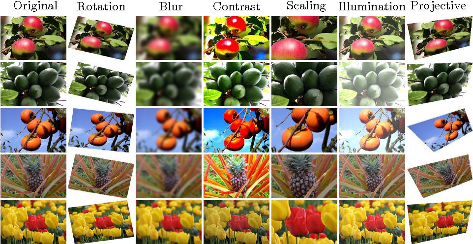

# Training Neural Networks

In this section, you will learn some of the techniques that are suggested before, during, and after a model has been trained.

## Data preprocessing

This project takes advantage of ConvNets properties regarding input preprocessing: few previous processing techniques are needed. Although some basic preprocessing forms are performed:

* **Mean subtraction**. In order to center the cloud of RGB values from input data around

  zero along every dimension of the image, a mean subtraction is applied across the image

  features.

* **Image normalization**. By dividing each RGB dimension of input images by its standard

  deviation, a normalization is obtained from its original 0 and 255 pixel values to 1 an 0

  normalized values. This preprocessing technique will avoid further issues caused by poor

  contrast images.

* **Image cropping & resizing**. Input images are preprocessed to be accepted by the architecture through cropping the image to the same aspect ratio as needed and resizing the

  original image to fit the architecture specifications.

## Overfitting vs. Underfitting

As we mentioned above, optimization algorithms first attempt to solve the problem of underfitting; that is, of taking a line that does not approximate the data well and making it approximate the data better. A straight line cutting across a curving scatter plot would be a good example of underfitting.

If the line fits the data too well, we have the opposite problem called “overfitting”. Solving underfitting is the priority, but much effort in machine learning is spent attempting not to overfit the line to the data. When we say a model overfits a dataset we mean it may have a low error rate for the training data but it does not generalize well to the overall population of data we’re interested in.

## Data Augmentation

We augment a dataset by applying synthetic alterations to individual samples, resulting in a new dataset with an effective size that is larger than the original. The typical goal is for the alterations to result in a synthetic sample that remains representative of the same general class as the source sample, but that cannot be trivially memorized alongside the original. When done properly, this augmentation can increase the training set.

## Transfer Learning

Training an entire convolutional neural network is not always possible, due to the fact that datasets are often not large enough. Alternatively, random initialization of weights is replaced by a pre-trained network on large datasets, i.e. ImageNet, that contains 1.2 million images labeled with 1,000 classes. This technique is known as **transfer learning** and it is very common in machine learning scenarios.

The main objective is the improvement of learning in a new task by transferring knowledge from a related task that has already been learned. In practice, Transfer Learning from a pre-trained ConvNet is typically used in these two different ways:

* **Fixed Feature Extraction**. Use the output of one intermediate layer to train a machine

  learning classifier.

* **Fine-tuning**. Replace the last fully connected layer of the network with a new classification

  task and use the training data from the new domain to update the weights of some layers.

In general, the earlier layers of the ConvNets are not updated and only the deeper ones are updated to the new task.

## Regularization

Machine learning models need to generalize well to new examples that the model has not seen in practice. In this module, we introduce regularization, which helps prevent models from overfitting the training data.

The penalty on a model's complexity. Regularization helps prevent [**overfitting**](https://developers.google.com/machine-learning/glossary#overfitting). Different kinds of regularization include:

* [**L1 regularization**](https://developers.google.com/machine-learning/glossary#L1_regularization)
* [**L2 regularization**](https://developers.google.com/machine-learning/glossary#L2_regularization)
* [**dropout regularization**](https://developers.google.com/machine-learning/glossary#dropout_regularization)
* [**early stopping**](https://developers.google.com/machine-learning/glossary#early_stopping) \(this is not a formal regularization method, but can effectively limit overfitting\)

## Model Ensemble

Ensemble methods have the objective of combining multiple models' predictions to get a better result than what a single model could potentially achieve individually. The idea behind is to put together multiple models with different properties and trained in different manners, in a way that the combination of these diverse predictions will generalize better.

